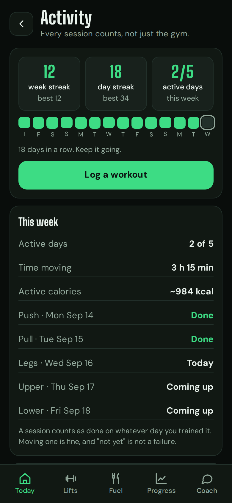
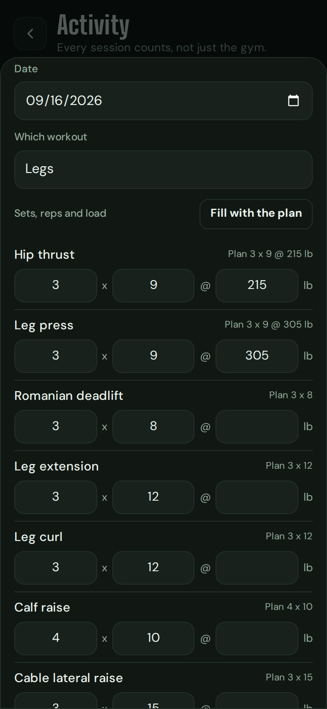
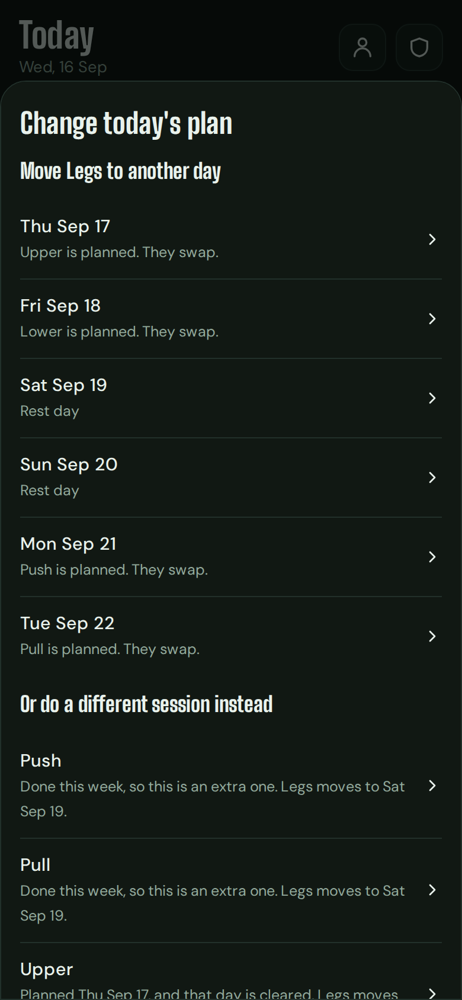
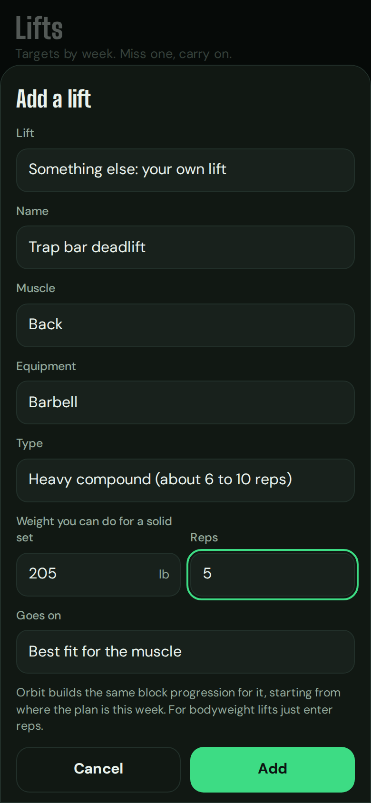

# Orbit

A private, local-first tracker for lifts, workouts and sport, food, body weight, measurements and progress photos, built around a 26-week plan (build, recomp or cut). No account, no server, no analytics. Your data lives in your browser and leaves only when you make a backup file. It installs on an iPhone, an Android phone or a computer and works offline.

<p align="center">
  
  
  
  
</p>

<details>
<summary>More screenshots</summary>

<p align="center">
  
  
  
  
</p>
<p align="center">
  
  
  
  
</p>
<p align="center">
  
  
  
  
</p>
<p align="center">
  
</p>
</details>

<p align="center"><sub>Screenshots use a made-up lifter, stand-in silhouettes and a stand-in AI reply, not real data.</sub></p>

## Features

**Plan**
- Answer a few questions and get calories, macros, a weekly split, week-by-week lift targets with planned deload weeks, and six-month measurement goals.
- Change targets any time. Profile shows your basics and your plan.

**Train**
- Log sets with effort and a rest timer. Each lift shows Hit, Partial or Todo against its weekly target.
- Track as many lifts as you like: about 40 are built in, and you can add your own (name, muscle, equipment, starting weight) and choose which workout it goes on. Stop tracking one any time; its history stays.
- Today shows the day's workout as a suggestion. Move it to another day, swap it with another session, train something else, or skip it for the week. Weekly targets do not depend on the weekday, and a moved session is never counted as missed.

**Activity**
- Log any workout by hand: swimming, football, tennis, badminton, pickleball, hot yoga, running, cycling and about twenty more, or your own. Pick the time and how hard it was.
- Strength training records which workout you did and the sets, reps and load. Those sets count towards your lift targets and the weekly log automatically.
- Active calories are estimated from the activity, time, effort and your weight (MET values from the Compendium of Physical Activities), or you can type the number from your watch. Your calorie target already allows for training, so there is nothing to eat back.
- A week streak (weeks that reach your active-days goal) and a day streak, a 14-day strip, a weekly log and trends. Progress and the coach use the same numbers.

**Fuel**
- Search about 7,200 foods (USDA data) with a Veg, Veg + egg or Non-veg filter, describe a meal to your own AI, type raw ingredients, or enter macros by hand.
- Add your own food list from a CSV or JSON file. For Indian foods, the IFCT 2017 tables are the best source, and [how to get them](#food-data) takes a few minutes. The list stays on your device.
- AI results always show an editable confirmation card. Nothing is saved until you tap "Looks right".

**Body and photos**
- Log weigh-ins and measurements in kg or lb and cm or in.
- A weekly photo check-in (five angles) on the day you pick, Friday by default. Today reminds you and flags any you missed.
- Scrub or play through your check-ins with the numbers of each day under the photo, compare any two dates, and save a time-lapse video or comparison image. Photos stay blurred until you tap.

**Workout library and reel**
- Keep gym photos and clips without copying them: Orbit stores a small preview and your originals stay where you took them.
- Ask your coach about form on a set, and stitch clips and check-in photos into one shareable MP4.

**Coach (optional)**
- A chat that runs on your model with your key (Anthropic, OpenAI, Gemini, or any OpenAI-compatible endpoint). It sees a summary of your lifts, food, weight and activity (never photos or notes) and can suggest changes, log a workout or move a session; you tap Apply; every change has Undo. Nothing else in the app needs AI.

**Backup and privacy**
- One encrypted backup file saved on your own device, replaced each time. Optional passcode.
- No account, no server, no third-party scripts. Nothing sensitive goes in the code repository.

## Get started

You need a browser and, optionally, Node 20+.

```sh
node scripts/serve.mjs        # then open http://localhost:8080
```

To use it on a phone, the app has to be served from an **https** address. [docs/INSTALL.md](docs/INSTALL.md) shows two ways: a private one only your own devices can reach (Tailscale, free) and a public static host. Then:

| | iPhone | Android |
| --- | --- | --- |
| Open the address in | Safari | Chrome |
| Install | **Share**, **Add to Home Screen**, **Add** | **⋮** menu, **Install app** |
| Save backups with | **Save or share**, **Save to Files** (choose **Replace**) | Share sheet to Files or Drive, or a folder you pick once |
| Workout originals | Picked again when you need them | Linked if Chrome allows, otherwise picked again |

Then open Orbit from its home screen icon, answer the setup questions (about four minutes), and make your first backup: Today, the shield icon, **Back up now**. Android and iPhone details, updating, and troubleshooting are in [docs/INSTALL.md](docs/INSTALL.md).

## Documentation

- [docs/INSTALL.md](docs/INSTALL.md): run, install on iPhone or Android, update, fix problems.
- [docs/USER_GUIDE.md](docs/USER_GUIDE.md): photo trend, food database and your own food list, workout library, form check, reel, and the AI features and your key.
- [docs/BACKUP.md](docs/BACKUP.md): make and restore a backup, and keep the app if you do not use it daily.
- [docs/ARCHITECTURE.md](docs/ARCHITECTURE.md): how it fits together and why, and the file layout.
- [SECURITY.md](SECURITY.md): what is and is not protected.
- [data/SOURCES.md](data/SOURCES.md): where the food data comes from and the terms it comes with.

## Food data

Orbit bundles about 7,200 foods from USDA FoodData Central. It does **not** bundle the Indian Food Composition Tables 2017 (IFCT), because their publisher, the National Institute of Nutrition (ICMR) in Hyderabad, allows personal use with acknowledgement but not electronic redistribution without written permission. **If you eat Indian food, loading IFCT as your own list is recommended.** It adds 542 foods (dals, millets, vegetables, paneer, eggs, meat and fish) with the diet tag and everyday names filled in. It takes a few minutes and you keep the file to yourself:

1. **Get the table.** In a terminal: `npm pack @ifct2017/compositions@2.0.9`, then `tar xzf ifct2017-compositions-2.0.9.tgz`. The table is `package/index.csv`. That package is a community packaging of the published tables; the data itself belongs to the Institute. You can also use the official IFCT 2017 book and site.
2. **Convert it.** From this folder: `node scripts/ifct-to-import.mjs package/index.csv --out ~/Documents/orbit-private/ifct.orbitfoods.json`. The script refuses to write inside the Orbit folder, and `*.orbitfoods.json` is ignored by git and blocked by the privacy check.
3. **Load it.** In Orbit: Fuel, **Add food**, **Find**, **Add my own food list**, choose the file, then **Use this list**. Those foods show the list name as their source and follow the Veg / Egg / Non-veg filter. Choose the file again on a new phone; it is not in backups.

Please keep to the Institute's terms: personal use, cite *Indian Food Composition Tables 2017, National Institute of Nutrition (ICMR), Hyderabad*, and do not publish or share the converted file. IFCT lists raw foods and available carbohydrate, so weigh raw food against a raw entry. Other tables work too: any CSV or JSON in the [documented format](docs/USER_GUIDE.md#your-own-food-list) can be loaded.

## Privacy in short

No account or server. No third-party scripts, fonts or requests. A strict Content Security Policy plus Trusted Types means injected script cannot run and text is never interpreted as HTML. Backups are encrypted with PBKDF2 and AES-256-GCM. An optional passcode gates the screen. Your AI key is never in a backup, a log or the repository. Read [SECURITY.md](SECURITY.md) for what is and is not protected.

## Keep your data out of git

This repository is for code. The `.gitignore` blocks photos, backups and profile files, and a pre-commit and pre-push check refuses anything that looks like personal data or a key.

```sh
sh scripts/install-hooks.sh
```

Optionally list words you never want committed (your name, measurements) in `~/.orbit-private-terms`, one per line. The check reports matches by line number without printing the terms.

## Develop

Everything is plain HTML, CSS and JavaScript. There is nothing to build and no runtime dependency.

```sh
npm test          # plan engine and food database unit tests, no dependencies
npm run e2e       # browser tests (needs Playwright: npm i -g playwright && npx playwright install chromium)
```

The end-to-end tests use fictional numbers and a fake AI provider, and check the security claims (CSP, Trusted Types, hostile input, encrypted round trips, file:// and localhost). The file layout is in [docs/ARCHITECTURE.md](docs/ARCHITECTURE.md#files).

## License

The code is MIT. Fonts (Big Shoulders Display, DM Sans) are under the SIL Open Font License; see `fonts/`.

The bundled food data in `data/foods.json` is **not** covered by the code's licence. It is USDA FoodData Central SR Legacy (public domain, CC0), as arranged in the TempoLife food database (CC-BY-4.0): *Food nutrition data from TempoLife (tempolife.app), CC-BY-4.0.* USDA asks for this acknowledgement: *U.S. Department of Agriculture, Agricultural Research Service. FoodData Central. fdc.nal.usda.gov.* The Indian Food Composition Tables (IFCT 2017) are **not** included, because their publisher does not allow electronic redistribution without written permission; you can load a copy you obtained yourself as your own list, see [docs/USER_GUIDE.md](docs/USER_GUIDE.md#your-own-food-list). Details: [data/SOURCES.md](data/SOURCES.md).
