# Orbit

A private, local-first tracker for lifts, food, body weight, measurements and progress photos, built around a 26-week plan (build, recomp or cut). No account, no server, no analytics. Your data lives in your browser and leaves only when you make a backup file. It installs on an iPhone, an Android phone or a computer and works offline.

<p align="center">
  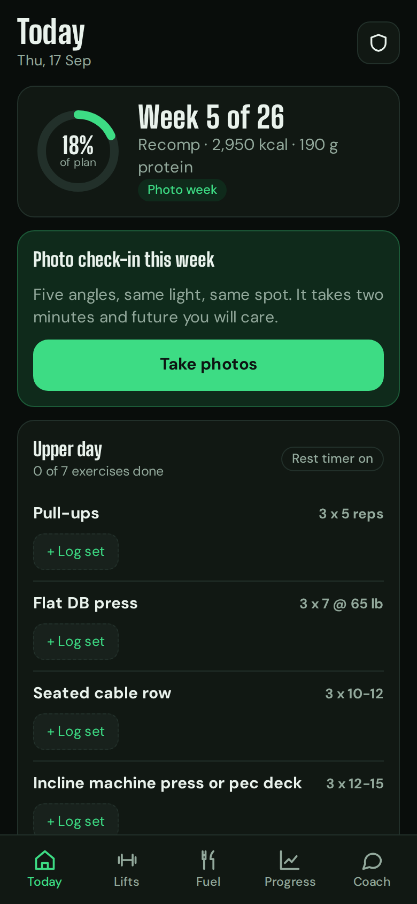
  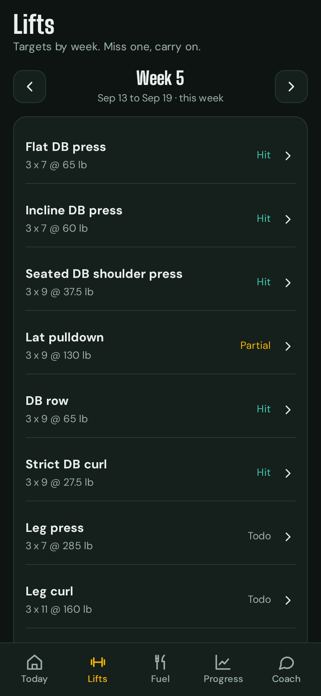
  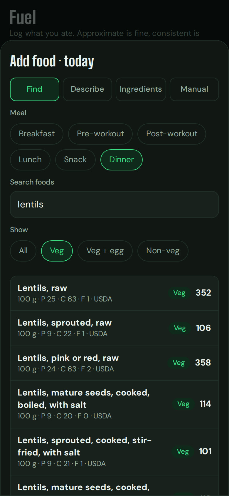
  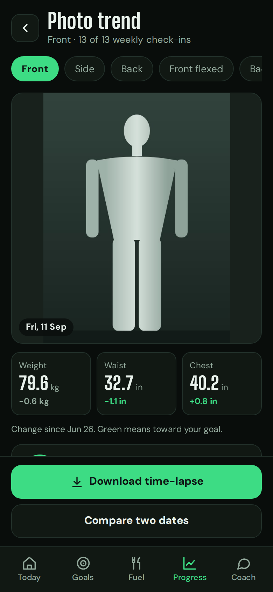
</p>

<details>
<summary>More screenshots</summary>

<p align="center">
  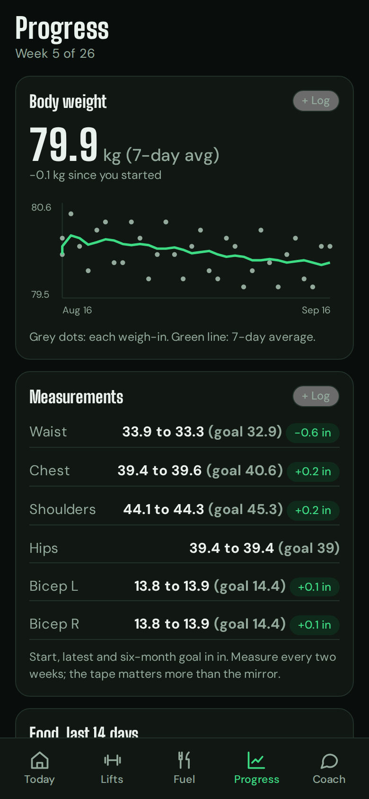
  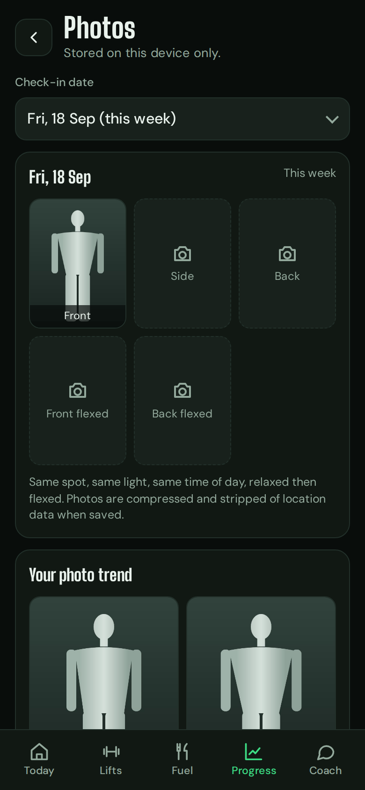
  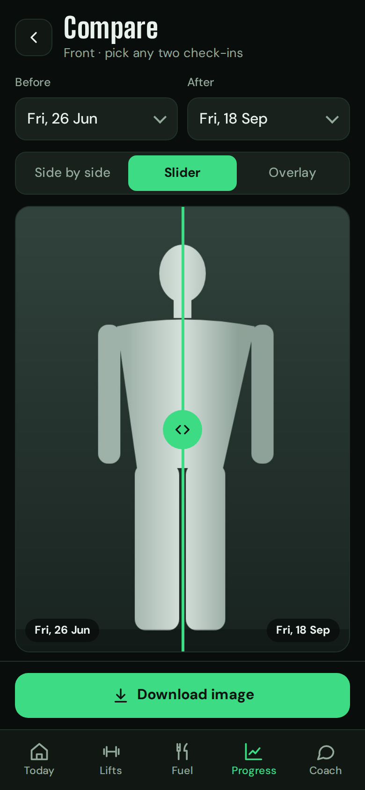
  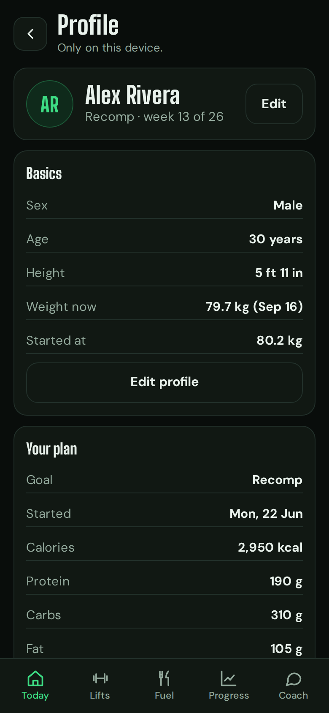
</p>
<p align="center">
  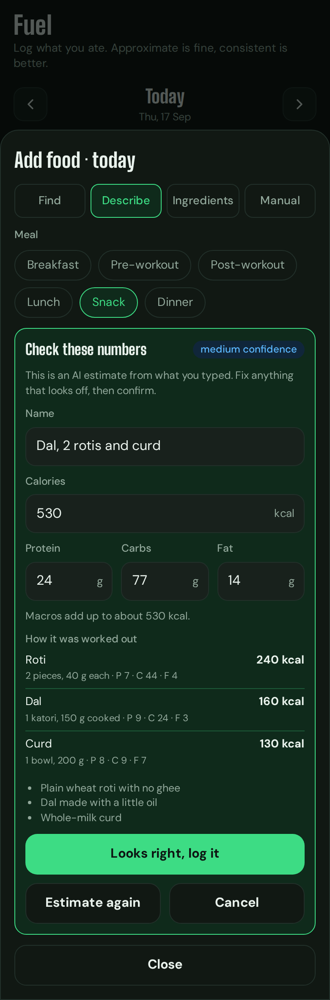
  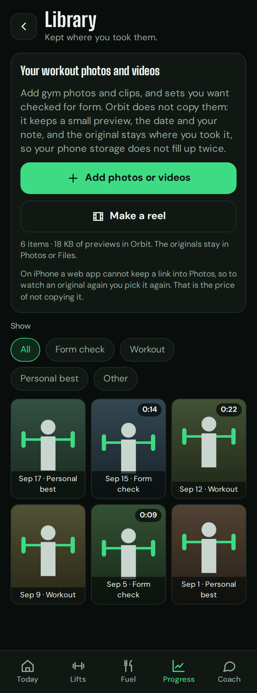
  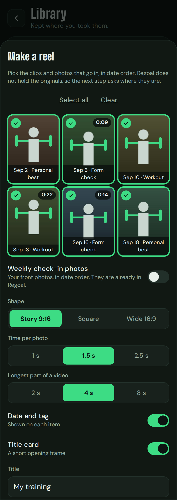
  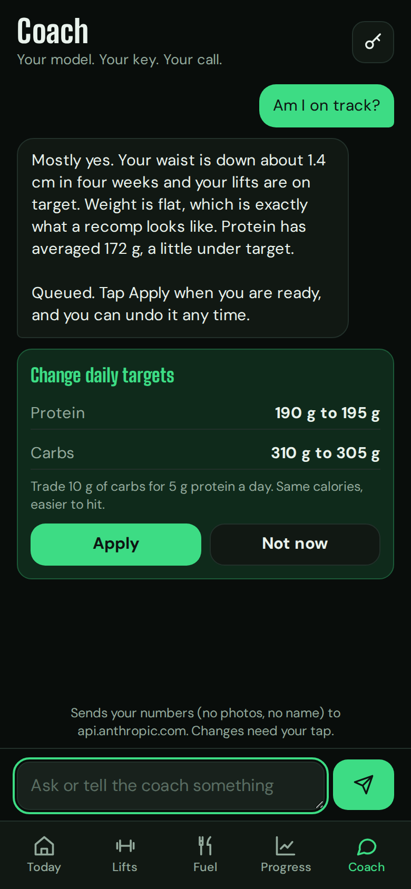
</p>
<p align="center">
  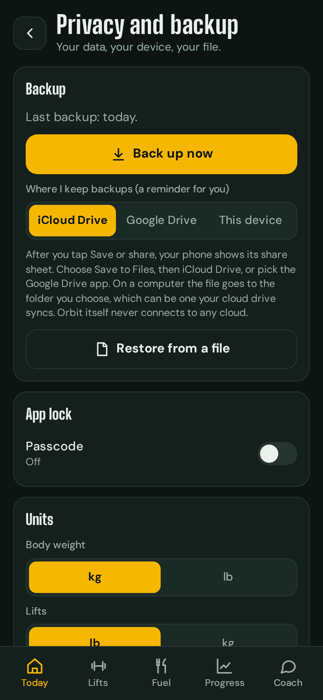
</p>
</details>

<p align="center"><sub>Screenshots use a made-up lifter, stand-in silhouettes and a stand-in AI reply, not real data.</sub></p>

## Features

**Plan**
- Answer a few questions and get calories, macros, a weekly split, week-by-week lift targets with planned deload weeks, and six-month measurement goals.
- Change targets any time. Profile shows your basics and your plan.

**Train**
- Log sets with effort and a rest timer. Each lift shows Hit, Partial or Todo against its weekly target.
- Today shows the day's workout. Missed weeks show as Behind, not as an error, and you can catch up or skip.

**Fuel**
- Search about 7,800 foods with a Veg, Veg + egg or Non-veg filter, describe a meal to your own AI, type raw ingredients, or enter macros by hand.
- AI results always show an editable confirmation card. Nothing is saved until you tap "Looks right".

**Body and photos**
- Log weigh-ins and measurements in kg or lb and cm or in.
- A weekly photo check-in (five angles) on the day you pick, Friday by default. Today reminds you and flags any you missed.
- Scrub or play through your check-ins with the numbers of each day under the photo, compare any two dates, and save a time-lapse video or comparison image. Photos stay blurred until you tap.

**Workout library and reel**
- Keep gym photos and clips without copying them: Orbit stores a small preview and your originals stay where you took them.
- Ask your coach about form on a set, and stitch clips and check-in photos into one shareable MP4.

**Coach (optional)**
- A chat that runs on your model with your key (Anthropic, OpenAI, Gemini, or any OpenAI-compatible endpoint). It can suggest changes; you tap Apply; every change has Undo. Nothing else in the app needs AI.

**Backup and privacy**
- One encrypted backup file saved on your own device, replaced each time. Optional passcode.
- No account, no server, no third-party scripts. Nothing sensitive goes in the code repository.

## Get started

You need a browser and, optionally, Node 20+.

```sh
node scripts/serve.mjs        # then open http://localhost:8080
```

To use it on a phone, the app has to be served from an **https** address. [docs/INSTALL.md](docs/INSTALL.md) shows two ways: a private one only your own devices can reach (Tailscale, free) and a public static host. Then:

| | iPhone | Android |
| --- | --- | --- |
| Open the address in | Safari | Chrome |
| Install | **Share**, **Add to Home Screen**, **Add** | **⋮** menu, **Install app** |
| Save backups with | **Save or share**, **Save to Files** (choose **Replace**) | Share sheet to Files or Drive, or a folder you pick once |
| Workout originals | Picked again when you need them | Linked if Chrome allows, otherwise picked again |

Then open Orbit from its home screen icon, answer the setup questions (about four minutes), and make your first backup: Today, the shield icon, **Back up now**. Android and iPhone details, updating, and troubleshooting are in [docs/INSTALL.md](docs/INSTALL.md).

## Documentation

- [docs/INSTALL.md](docs/INSTALL.md): run, install on iPhone or Android, update, fix problems.
- [docs/USER_GUIDE.md](docs/USER_GUIDE.md): photo trend, food database, workout library, form check, reel, and the AI features and your key.
- [docs/BACKUP.md](docs/BACKUP.md): make and restore a backup, and keep the app if you do not use it daily.
- [docs/ARCHITECTURE.md](docs/ARCHITECTURE.md): how it fits together and why, and the file layout.
- [SECURITY.md](SECURITY.md): what is and is not protected.
- [data/SOURCES.md](data/SOURCES.md): where the food data comes from and the terms it comes with.

## Privacy in short

No account or server. No third-party scripts, fonts or requests. A strict Content Security Policy plus Trusted Types means injected script cannot run and text is never interpreted as HTML. Backups are encrypted with PBKDF2 and AES-256-GCM. An optional passcode gates the screen. Your AI key is never in a backup, a log or the repository. Read [SECURITY.md](SECURITY.md) for what is and is not protected.

## Keep your data out of git

This repository is for code. The `.gitignore` blocks photos, backups and profile files, and a pre-commit and pre-push check refuses anything that looks like personal data or a key.

```sh
sh scripts/install-hooks.sh
```

Optionally list words you never want committed (your name, measurements) in `~/.orbit-private-terms`, one per line. The check reports matches by line number without printing the terms.

## Develop

Everything is plain HTML, CSS and JavaScript. There is nothing to build and no runtime dependency.

```sh
npm test          # plan engine and food database unit tests, no dependencies
npm run e2e       # browser tests (needs Playwright: npm i -g playwright && npx playwright install chromium)
```

The end-to-end tests use fictional numbers and a fake AI provider, and check the security claims (CSP, Trusted Types, hostile input, encrypted round trips, file:// and localhost). The file layout is in [docs/ARCHITECTURE.md](docs/ARCHITECTURE.md#files).

## Roadmap

Part 2 is in: the reel and the coach's form check run on your device and your key. Ideas not built: audio or music in the reel, choosing the exact section of a clip, and cooked Indian dishes measured in the food database.

## License

The code is MIT. Fonts (Big Shoulders Display, DM Sans) are under the SIL Open Font License; see `fonts/`. The food data in `data/foods.json` is **not** covered by the code's licence: it comes from USDA (public domain) and from India's IFCT 2017 tables (personal use unless the National Institute of Nutrition gives permission). Read [data/SOURCES.md](data/SOURCES.md) before making the repository public or hosting the app publicly.
