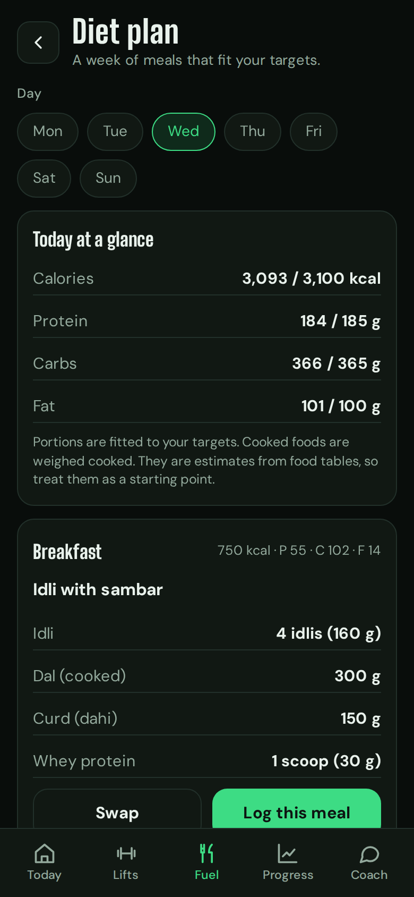
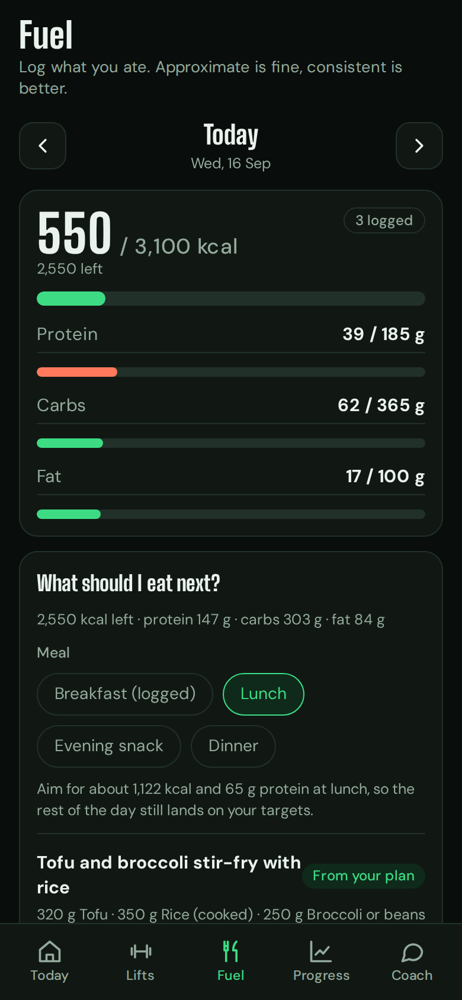
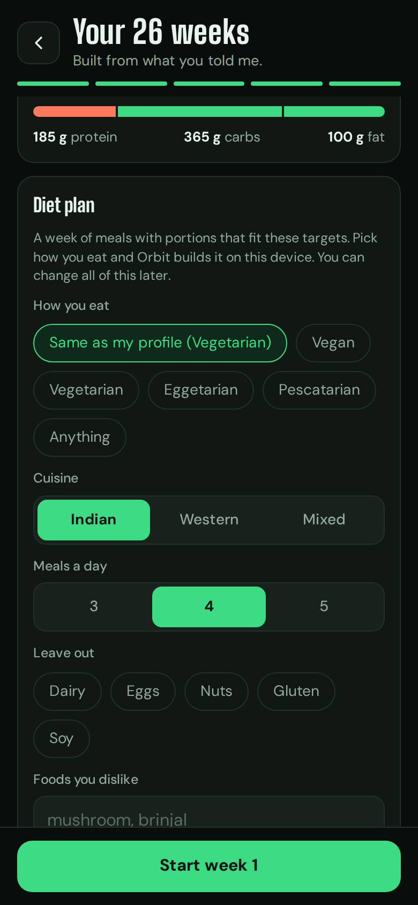
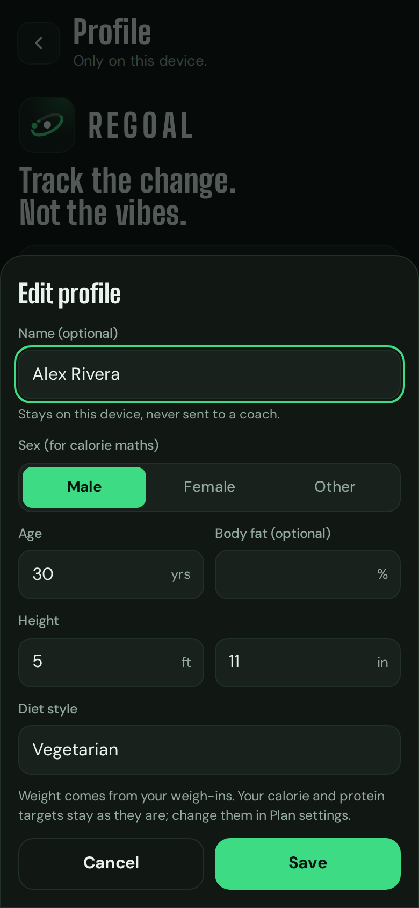

# User guide

How the bigger features work, in more detail than the README. For installing, see [INSTALL.md](INSTALL.md); for backups, see [BACKUP.md](BACKUP.md).

## Activity, streaks and moving your workout

**Log any workout.** Today and Progress have an Activity card, and Activity has the full screen (Today, then Details). **Log a workout**, choose what you did (strength training, swimming, football, tennis, badminton, pickleball, hot yoga, running, cycling, walking, HIIT and more, or *Other activity* with your own name), the date, how long, and how hard it was (easy, moderate or hard). Nothing here needs a watch or a phone sensor; everything is typed in. Tap a workout in History to edit or delete it.

**Calories burnt are estimates.** Orbit uses (MET - 1) x your weight x hours, with MET values from the Compendium of Physical Activities for that activity and effort, and your weight from your weigh-ins. Pickleball has no official value, so its numbers are a middle-of-the-road guess. If your watch gives a number you trust more, type it in the Calories burnt box and it is used instead and marked "yours". Your calorie target already allows for training days, so there is no need to eat the active calories back. Fuel shows them for the day, and the coach can see them.

**Strength training.** Pick which workout you did (Push, Pull and so on, or Something else), then **Fill with the plan** or type sets, reps and load for each exercise; leave an exercise empty to skip it. Add any other exercise from the list or by name. The sets are saved as ordinary lift sets, so Hit, Partial and the charts on each lift update, and the weekly plan marks that workout done. If you already logged sets on Today, use **Add how long it took** there (or tap the day in History) to add the time and count the calories without entering the sets twice. Deleting a strength workout removes the sets that were logged with it.

**Streaks.** A day counts as active when you log any workout or any working set (warm-ups do not count). The *day streak* counts consecutive active days, and today never breaks it: it only ends after a full day without activity. The *week streak* counts weeks in a row (plan weeks) that reach your goal of active days; the default is your number of training days, and you can change it from 2 to 7 at the bottom of Activity. The week in progress never breaks a streak either. There is also a 14-day strip, a weekly log with time, calories and sessions done, and trend charts.

**The plan is a suggestion.** The plan gives each workout a weekday, but weeks change. On Today, **Change** lets you move the workout to another day (if that day has a session, they swap), do a different session instead, or skip it for the week. On a rest day, **Train anyway** pulls a session forward. Lift targets, calories and weekly checks do not depend on the weekday. A session counts as done on whatever day you trained it, and a session you moved or skipped is not treated as a miss, by the app or by the coach.

**Coach.** The coach gets a summary (streaks, active days against your goal, this week's sessions and whether they were done, the last four weeks, a 28-day mix of activities with minutes and estimated calories, your last ten workouts and any moved sessions) so it can spot patterns, such as too little recovery or lifting slipping in a heavy sports week. It never sees workout notes. It can propose logging a workout or moving a session, and you tap Apply like any other change.

## Lifts: track as many as you like

Lifts, then **Add a lift**. About 40 are built in (barbell, dumbbell, machine, cable and bodyweight); pick one, enter a weight and reps you can do for a solid set, and Orbit builds the same week-by-week progression for it. **Something else** lets you add your own: name, muscle, equipment, whether it is a heavy compound, medium or high-rep lift, and where you are now. Choose which workout it goes on, the best fit for the muscle, or none if you only want to track it. There is no limit. On a lift's page, **Stop tracking this lift** removes it from your targets; your logged sets stay in your history and the exercise stays in its workout as a plain one. Onboarding has the same **Add another lift** button.

## Your diet plan

Right after your macros in setup there is a **Diet plan** card. Pick how you eat (or leave it on **Same as my profile**), your cuisine (Indian, Western or Mixed), how many meals a day (3, 4 or 5), foods to leave out (dairy, eggs, nuts, gluten, soy) and any foods you dislike. A sample day shows straight away. You can change all of it later under Profile or Plan settings, **Diet preferences**.

**Open diet plan** (from Profile, Plan settings or Fuel) shows a day at a time with gram portions for every food: countable foods are whole pieces (3 idlis, 2 eggs, 1 scoop). The totals sit close to your calories and macros. **Swap** replaces one meal with another that fits, **Shuffle the week** starts a different rotation, and **Log this meal** adds each food to today's Fuel log as its own entry, which you can edit or delete like any other. Nothing is logged unless you tap.

How it works: Orbit has about 55 everyday foods and about 60 meal ideas. Your choices filter the ideas, then each meal's portions are nudged, one step at a time, until the meal lands near its share of your day. If protein is short, a protein food that suits your diet (whey, Greek yogurt, egg whites, plant protein, and so on) is added. The same preferences always give the same week. This is a suggestion from tables, not medical advice; if you have an allergy or a health condition, check with a professional.

**What should I eat next?** sits on Fuel, under Add food, for today. It works out what is left of your calories and macros after everything you logged, picks the next meal you have not logged (or the one you choose), and offers up to three meals with portions fitted to what is left. If you ate a big breakfast, lunch gets smaller portions. If protein is behind, it suggests a quick top-up. **Log this** adds it to today.

The optional AI buttons ("Ask for tips on this day", "Ask the coach about this") send only the meals and your eating preferences as text to your provider, and only when you tap. They return text tips. They never change the plan and never log anything.

<p align="center">  </p>

## Your profile

Open Profile from the person icon on Today. It starts with the Orbit logo and the tagline, *Track the change. Not the vibes.*, the same as the welcome screen. **Edit** (or **Add name**) at the top and **Edit profile** under Basics open the same sheet: name, sex, age, height, body fat and diet style. Only what you change is saved, as one change you can undo, and it is kept in backups. The name is never sent to a coach. Weight is not edited here: it comes from your weigh-ins. Changing age, height or sex does not change your calorie and protein targets; those are in Plan settings (**Plan settings**, then **Edit targets** or **Change goal**).

<p align="center"> </p>

## Your photo trend

Take the same five angles at your weekly check-in. The day is yours to set in **Profile** (Friday to begin with); Today asks for it that day, stays on it until all five are saved, and flags any week you missed. Check-ins are named by their date (Fri, 18 Sep), never "week 5": the Photos screen has one list of dates, and the trend, compare and downloads all show dates. Then:

1. Progress, then **Open** on Progress photos, then **See trend** in the Your photo trend card. Pick an angle and drag along the check-in dots, or press play. The weight and measurements from around each photo's date sit under it, and green means the change is toward your goal.
2. **Compare two dates** lets you pick any two check-ins and view them side by side, with a slider, or as an overlay that helps you line up your pose. The table underneath shows the change.
3. **Download time-lapse** makes a short video (Story, Square or Original shape) and **Download image** makes a comparison picture (JPEG or PNG). Both are built on your device. When one is ready, tap **Save or share** and choose Save to Photos or Files.

Two things to know about downloads. The saved file shows your photos **unblurred** and is **not encrypted**, so it is as private as wherever you put it. Orbit says so in each sheet. And a video is recorded in real time, so keep Orbit open on screen until it finishes. Videos are always MP4 (H.264), so they play on any phone or laptop and post to Instagram. A browser that cannot record MP4 hides the video option and you can still save the comparison image.

## The food database

Fuel's **Find** tab searches about 7,200 foods, each with calories, protein, carbs, fat and fibre per 100 g, and asks for the amount in grams. A filter under the search box shows **All**, **Veg**, **Veg + egg** or **Non-veg**; it starts from the diet you gave in Profile and remembers your choice. Type a word or the start of one ("paneer", "chick", "dal"). Many foods also answer to everyday Indian names ("atta", "dahi", "bhindi", "ghee").

Where it comes from, and what to watch for:

- The bundled rows are from the US **USDA SR Legacy** database (public domain), as arranged by TempoLife (CC-BY-4.0). They are one static file, `data/foods.json`, that the app fetches from its own address. Nothing is looked up online. See [data/SOURCES.md](../data/SOURCES.md) for the exact package, licences and how the file is built (`scripts/build-foods.mjs`).
- The vegetarian and non-vegetarian tags are worked out from the food's name and category by rules, and checked by tests, but they are a **filter, not a guarantee**. Cheese is tagged vegetarian even though some is made with animal rennet, and anything unclear (restaurant items, canned soups, branded products) is tagged "check the label" and appears only under All.
- USDA does not measure home-cooked Indian dishes, so a plate of rajma chawal is not in it. The short starter list of common dishes is labelled approximate, and the **Describe** and **Ingredients** tabs are for everything else.
- USDA carbohydrates include fibre. Orbit shows the number as the source gives it.

## Your own food list

Want foods that are not in the bundled list, for example Indian Food Composition Tables values? Orbit does not ship those, because their publisher does not allow it. You can load a list you have the right to use, from a file on your device:

1. Fuel, **Add food**, **Find**, then **Add my own food list** at the bottom.
2. Choose a `.csv` or `.json` file. Orbit shows how many foods it can use and how many rows it skipped, and stores nothing until you tap **Use this list**.
3. Search as usual. Your foods show **My list** as their source and follow the same diet filter.

The list is kept **on this device only**. It is not in backups and never uploaded, so choose the file again on a new phone. **Replace** loads another file; **Remove** deletes it. Foods you already logged stay in your log either way.

**File format.** All values are per 100 g. A CSV needs a header row; `fibre`, `diet` and `aliases` are optional:

```
name,kcal,protein,carbs,fat,fibre,diet,aliases
Example millet flour,361,11.5,67.5,5,11.5,veg,bajra
```

`diet` is `veg`, `egg`, `nonveg` or `check` (anything else, or empty, becomes "check the label"). `aliases` are extra words that should find the food. A JSON file can be a list of the same objects, or `{"name": "My list", "foods": [ ... ]}`. Values must be numbers (kcal up to 900, the rest up to 100), and rows that are not are skipped. Files up to 15 MB and 30,000 foods are read. A working example is [food-import-example.csv](food-import-example.csv).

**IFCT 2017 (recommended for Indian foods).** The step-by-step version is in the README under [Food data](../README.md#food-data). The tables are copyright the National Institute of Nutrition (ICMR) in Hyderabad, and their terms allow personal use with acknowledgement. If you have a copy of the compositions table (`index.csv` from the `@ifct2017/compositions` package, fetched with `npm pack @ifct2017/compositions`), `node scripts/ifct-to-import.mjs index.csv --out ~/Documents/orbit-private/ifct.orbitfoods.json` converts it to this format, with diets and everyday names filled in. The script refuses to write inside the Orbit folder, and `*.orbitfoods.json` is ignored by git and blocked by the privacy check. Keep the file to yourself unless the Institute gives permission. IFCT lists available carbohydrate and usually raw foods, so weigh raw against a raw entry.

## Library, form check and reel

Progress, then **Open** on Workout photos and videos. **Add photos or videos** takes any number of them, tagged Workout, Form check, Personal best or Other, with an optional exercise and note.

**Nothing is copied.** Orbit stores only a preview picture (about 15 KB), the date, your tag and note, and the file's name and size. The original stays in Photos or Files, so your phone does not hold everything twice. What that means where:

- **iPhone (Safari or the Home Screen app):** a web app cannot keep a link into your photo library, so to watch an original again, or to use it in a form check or reel, you pick it again. Orbit uses it in memory and lets go. This is the price of not copying it.
- **Chrome or Edge on a computer, and recent Chrome on Android:** Orbit can keep a real link to each file, so it opens without asking again. If you move or rename the file, the link stops working and you pick it again. If a link cannot be made, Orbit uses the normal file picker instead.

**Watching or viewing the original.** Open an item and tap **Watch the original** (or **View the original** for a photo). On an iPhone the file picker opens; choose the same photo or video again. If the browser cannot show the file (some phone formats, such as HEIC photos and HEVC videos, only open on Apple devices), Orbit says so instead of showing a blank box, and the original is still fine in Photos or Files.

A backup includes the entries and their previews, never the originals. Removing an item from Orbit does not touch the photo or video.

**Ask the coach about form.** Open an item and tap it. For a video Orbit takes six still frames spread across it (one for a photo), shows them to you, and names the provider they will go to. Nothing is sent until you tap Send. They go with your own key, are not saved, and can show your face and surroundings. The coach says what it can see and suggests up to four cues; it cannot judge speed or feel, and it can be wrong. You can save the written review with the item.

**Make a reel.** Choose items from the library, optionally add your weekly check-in photos (already in Orbit), pick Story, Square or Wide, and how long each photo and video part lasts (long videos are trimmed to their middle). Orbit finds the originals (through saved links, or you pick them all at once and it matches them by name and size), then records the reel on your device as an MP4 with a title card, date and tag on each item, and no sound. It is recorded in real time, so keep Orbit open until it finishes. The result exists only until you save or share it. Like the time-lapse, it shows your photos unblurred and is not encrypted.

## The AI features and your key

Nothing in Orbit needs AI. If you want the coach or food estimates, Coach settings lets you choose Anthropic, OpenAI, Google Gemini, or any OpenAI-compatible endpoint (Ollama, LM Studio, OpenRouter). The browser talks straight to that provider with your key, so it costs Orbit nothing and there is no shared AI.

Where the key can live:

| Mode | What happens |
| --- | --- |
| This device (default) | Enter it once. It is encrypted with a key the browser keeps and will not export, and loads by itself each time you open Orbit. Nothing to type again. |
| Passphrase | Stored encrypted with a passphrase (AES-256) on this device. You type the passphrase to unlock it. |
| Session | Held in memory. Closing the app forgets it. |
| From a key file | Read into memory from a file you pick. Never copied or stored. |

**When a key expires.** If the provider turns a key down (expired, revoked or mistyped), Orbit says so, drops that key, and opens a sheet asking for a new one. Paste it, leave **Remember it on this device** on, and tap Save key; the new one replaces the old. Coach settings then shows "Key rejected: update it" until you do. **Forget the saved key** in Coach settings deletes it from the device. Each provider keeps its own saved key.

**Be clear about what "This device" is.** It stops you retyping the key and keeps it out of backups, exports and the repository, but it is a convenience, not a vault. Anyone who can open Orbit on your unlocked device can use the key, so turn on the app lock in Settings if others use your phone. Use Passphrase if you want to type something each time. Safari can clear a website's storage after about a week without use unless the app is installed to the Home Screen, so install it (see [INSTALL.md](INSTALL.md)) and the key will stay. If it is ever cleared, Orbit simply asks again.

The key is never included in backups, never written to logs and never put in the repository. Model names change over time; the default is a starting point, so use one from your provider's docs.

What the AI sees: the coach gets a summary of your numbers (weight, measurements, lift status, food totals), not your name and not your photos. The photo trend, downloads and reel never call any AI. A food estimate gets only the text you typed. A form check sends the few frames you confirmed, and nothing else.

Using another endpoint: the Content Security Policy in `index.html` lists the only places the app may connect to. Add your endpoint's origin to `connect-src` once (for example `https://openrouter.ai`) and reload. `http://localhost` is already allowed for local models.
